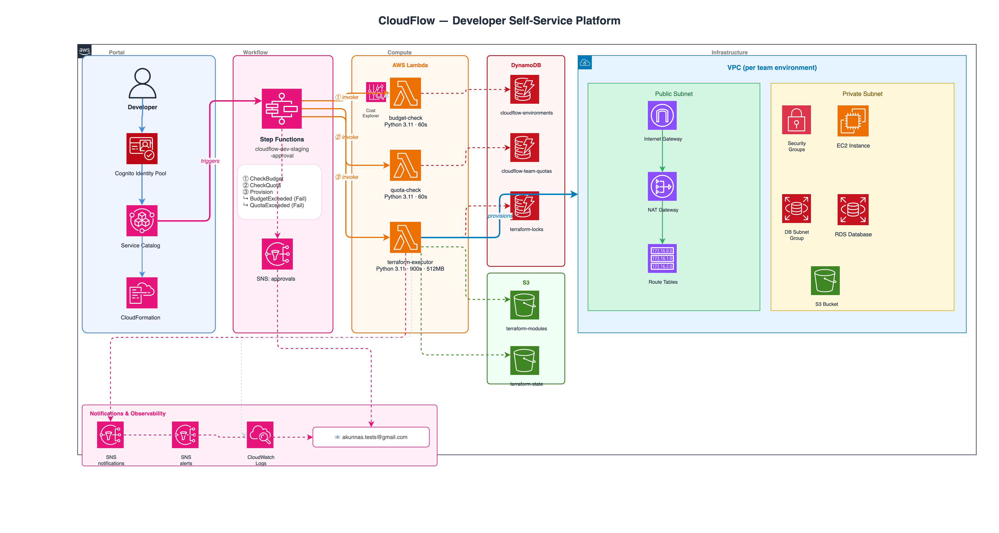

# CloudFlow Platform

**Self-service AWS infrastructure automation platform**

Reduces environment provisioning from 2-3 days to 3 minutes with automated approval workflows, cost controls, and governance.

## Architecture



## Overview

CloudFlow automates AWS environment provisioning with built-in approval workflows, budget enforcement, and quota management. Teams request environments via AWS Service Catalog, and the platform automatically provisions complete 3-tier VPC infrastructure in minutes.

## Components

### Platform Services
- **AWS Service Catalog**: Self-service portal for environment requests
- **AWS Step Functions**: Orchestrates approval workflow
- **AWS Lambda Functions**:
  - `budget-check`: Validates team spending against monthly limits
  - `quota-check`: Enforces environment quotas per team
  - `terraform-executor`: Provisions complete VPC infrastructure
- **Amazon DynamoDB**: Tracks all provisioned environments
- **Amazon SNS**: Sends notifications for approvals and completions
- **Amazon S3**: Stores Terraform modules and state

### Infrastructure Provisioned Per Environment
- VPC with 3-tier architecture (10.0.0.0/16)
- Internet Gateway + NAT Gateway with Elastic IP
- 4 Subnets across 2 Availability Zones
- Route tables with proper routing configuration
- Security groups for EC2 and RDS
- RDS subnet group (Multi-AZ ready)
- S3 bucket for application data

## Key Features

✅ **Self-Service Portal** - Teams request via AWS Service Catalog  
✅ **Automated Approval** - Budget and quota checks via Step Functions  
✅ **Instant Provisioning** - Complete infrastructure in ~3 minutes  
✅ **Cost Controls** - Budget limits and team quotas enforced  
✅ **Resource Tracking** - DynamoDB records all provisioned resources  
✅ **Notifications** - SNS alerts for approvals and completions  

## Quick Start

### Prerequisites
- AWS Account with AWS Organizations
- Terraform >= 1.0
- AWS CLI configured

### Deploy Platform
```bash
cd platform/terraform
terraform init
terraform apply
```

### Request Environment

1. Navigate to AWS Service Catalog
2. Select "Dev Environments" portfolio
3. Launch "Dev Environment" product
4. Provide: TeamName, AppName, RequestedBy
5. Wait ~3 minutes for provisioning

## Technical Details

**Budget Limits:**
- Dev: $150/month per account
- Staging: $400/month per account
- Prod: $1,200/month per account

**Quota Limits:**
- Dev: 3 environments per team
- Staging: 2 environments per team
- Prod: 1 environment per team

**Lambda Runtime:** Python 3.11  
**Region:** us-east-1  
**Provisioning Time:** ~3 minutes  

## Cost Analysis

**Platform Infrastructure:** ~$5/month
- DynamoDB on-demand
- Lambda pay-per-use
- S3 storage
- SNS notifications

**Per Environment:** ~$40/month
- NAT Gateway: $32/month
- Data transfer: ~$5/month
- VPC/Subnets/IGW: Free

## Results

**Efficiency:** Environment provisioning reduced from 2-3 days to 3 minutes (99% reduction)  
**Cost Savings:** Automated cost controls and quota enforcement  
**Consistency:** Standardized infrastructure across all environments  
**Auditability:** Complete tracking in DynamoDB with SNS notifications  

## Author

**Akunna Ndubuisi**  
Solutions Architect | AWS Certified  
Built as demonstration of production-grade infrastructure automation

## License

MIT License

---

## Full Implementation Roadmap

### Current State: Development Environment (Implemented ✅)

**What's Built:**
- Automated provisioning of dev VPCs
- Single NAT Gateway (cost-optimized)
- Budget check: $150/month limit
- Quota: 3 environments per team
- Auto-approval via Step Functions

**Infrastructure Provisioned:**
- VPC: 10.0.0.0/16
- 2 Availability Zones
- 1 NAT Gateway
- 4 Subnets (public, private app, 2x private DB)
- Security groups for EC2 and RDS
- RDS subnet group
- S3 bucket

---

### Planned: Staging Environment

**Design Decisions:**

**Higher Availability**
- 2 NAT Gateways (one per AZ) for redundancy
- Eliminates single point of failure present in dev
- Justification: Staging mirrors production behavior for realistic testing

**Enhanced Infrastructure**
- Application Load Balancer (ALB) for HTTP/HTTPS traffic distribution
- ECS Fargate cluster instead of EC2 for containerized workloads
- RDS db.t3.small (larger than dev's db.t3.micro)
- ElastiCache Redis for session management and caching
- CloudWatch dashboards for monitoring

**Approval Workflow**
- Same auto-approval as dev (budget + quota checks)
- Budget limit: $400/month
- Quota: 2 environments per team
- Justification: Teams need quick staging access for sprint cycles

**Cost Implications**
- ~$150/month per staging environment
  - 2 NAT Gateways: $64/month
  - ALB: $25/month
  - ECS Fargate: $30/month (estimated)
  - RDS db.t3.small: $20/month
  - ElastiCache: $15/month

**Implementation Plan:**
1. Create staging VPC Terraform module with dual NAT
2. Add ALB Terraform resources with target groups
3. Create ECS cluster + task definitions
4. Provision RDS with automated backups (7 days)
5. Add ElastiCache cluster configuration
6. Update Lambda to handle staging-specific provisioning
7. Create "Staging Environments" Service Catalog portfolio
8. Update Step Functions for staging workflow

---

### Planned: Production Environment

**Design Decisions:**

**Maximum Availability & Resilience**
- 3 Availability Zones (vs 2 for dev/staging)
- 3 NAT Gateways (one per AZ) for complete redundancy
- Justification: Zero tolerance for downtime in production

**Enterprise-Grade Infrastructure**
- Multi-AZ Application Load Balancer
- ECS Fargate with auto-scaling (min 3 tasks across AZs)
- RDS Multi-AZ deployment with automated backups (30 days)
- ElastiCache Multi-AZ with automatic failover
- CloudFront CDN for global content delivery
- WAF integration for application firewall protection

**Manual Approval Workflow**
- Budget check (automated): $1,200/month limit
- Quota check (automated): 1 environment per team
- **Manual approval required** from Platform Team Lead
- SNS notification triggers approval request
- Step Functions waits for manual approval via API
- Justification: Production changes require human oversight

**Security Enhancements**
- VPC Flow Logs to dedicated S3 bucket
- AWS Config rules for compliance monitoring
- GuardDuty threat detection enabled
- Security Hub aggregation
- Automated remediation via Lambda for common issues

**Disaster Recovery**
- Cross-region RDS read replica in us-west-2
- S3 cross-region replication for application data
- Automated snapshots retained for 30 days
- Documented failover procedures

**Cost Implications**
- ~$350/month per production environment
  - 3 NAT Gateways: $96/month
  - ALB: $25/month
  - ECS Fargate: $80/month (higher capacity)
  - RDS Multi-AZ db.t3.medium: $80/month
  - ElastiCache Multi-AZ: $40/month
  - CloudFront: $20/month (estimated)
  - Data transfer & backups: ~$10/month

**Implementation Plan:**
1. Create prod VPC Terraform with 3 AZs and triple NAT
2. Implement Multi-AZ RDS with cross-region replica
3. Configure ECS auto-scaling policies
4. Set up CloudFront distribution
5. Integrate WAF rules for common attack patterns
6. Create manual approval Lambda (SNS → API Gateway → approval UI)
7. Update Step Functions with manual approval state
8. Implement AWS Config rules:
   - Encrypted EBS volumes required
   - S3 buckets must have versioning
   - Security groups no unrestricted SSH (0.0.0.0/0:22)
   - RDS encryption at rest required
9. Set up cross-region DR automation
10. Create "Production Environments" Service Catalog portfolio

---

## Workflow Comparison

### Development (Current)
```
Request → Budget Check → Quota Check → Provision → Notify
         (automated)    (automated)    (3 min)
```

### Staging (Planned)
```
Request → Budget Check → Quota Check → Provision → Notify
         (automated)    (automated)    (5 min)
         Enhanced infrastructure (ALB, ECS, Redis)
```

### Production (Planned)
```
Request → Budget Check → Quota Check → Manual Approval → Provision → Notify
         (automated)    (automated)    (human gate)      (8 min)
                                       ⏱ Wait for Platform Team
         Full HA infrastructure + DR + Security controls
```

---

## Governance & Operations (Future)

### Automated Compliance
- AWS Config continuous compliance monitoring
- Automated remediation for non-compliant resources
- Monthly compliance reports to security team

### Cost Optimization
- Auto-shutdown Lambda for dev environments (6pm weekdays)
- 30-day lifecycle policy for dev environments (auto-delete)
- CloudWatch alarms at 50%, 80%, 100%, 120% of budget
- Weekly cost reports per team via SNS

### Monitoring & Alerting
- CloudWatch dashboards per environment
- SNS alerts for:
  - Failed provisioning attempts
  - Budget threshold breaches
  - Security group changes in prod
  - RDS failover events
- Integration with PagerDuty for prod alerts

### Operational Runbooks
- Environment provisioning troubleshooting
- Manual approval process for prod
- Disaster recovery failover procedures
- Cost investigation and optimization

---

## Why This Phased Approach?

**Start Small, Validate, Scale**
1. **Phase 1 (Complete)**: Prove concept with dev automation
2. **Phase 2 (Planned)**: Add staging with enhanced infrastructure
3. **Phase 3 (Planned)**: Production with full enterprise controls

**Risk Mitigation**
- Learn from dev automation before tackling prod
- Build confidence with stakeholders incrementally
- Identify edge cases in lower environments first

**Business Value Delivery**
- Immediate value: Dev teams unblocked (Phase 1 ✅)
- Medium-term: Staging acceleration for release cycles (Phase 2)
- Long-term: Production self-service with governance (Phase 3)

---

## Success Metrics

**Efficiency**
- Current: 2-3 days → Target: 3 minutes (dev), 5 minutes (staging), 8 minutes (prod)
- Current: 8 hours/week manual effort → Target: 1 hour/week

**Cost**
- 30% reduction in dev environment costs (auto-shutdown)
- Budget compliance: 95%+ environments within limits
- No surprise bills from forgotten resources

**Quality**
- 100% infrastructure consistency (IaC)
- Zero manual configuration drift
- Automated compliance: 98%+ Config rule adherence

**Adoption**
- Target: 15 teams using platform within 6 months
- 80%+ team satisfaction score
- <5 minute average approval time for prod requests

---

*This roadmap demonstrates end-to-end thinking from MVP to enterprise-grade platform. The phased approach balances speed of delivery with operational maturity.*
